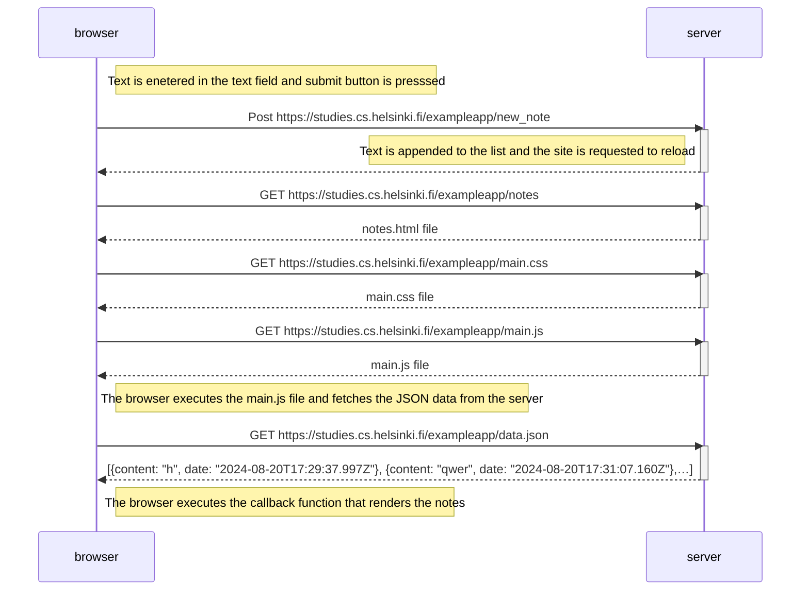

```mermaid
  sequenceDiagram
      participant browser
      participant server

      Note right of browser: Text is enetered in the text field and submit button is presssed
      browser->>server: Post https://studies.cs.helsinki.fi/exampleapp/new_note
      activate server
      Note left of server: Text is appended to the list and the site is requested to reload
      server-->>browser: 
      deactivate server
  
      browser->>server: GET https://studies.cs.helsinki.fi/exampleapp/notes
      activate server
      server-->>browser: notes.html file
      deactivate server
  
      browser->>server: GET https://studies.cs.helsinki.fi/exampleapp/main.css
      activate server
      server-->>browser: main.css file
      deactivate server
  
      browser->>server: GET https://studies.cs.helsinki.fi/exampleapp/main.js
      activate server
      server-->>browser: main.js file
      deactivate server
  
      Note right of browser: The browser executes the main.js file and fetches the JSON data from the server
  
      browser->>server: GET https://studies.cs.helsinki.fi/exampleapp/data.json
      activate server
      server-->>browser: [{content: "h", date: "2024-08-20T17:29:37.997Z"}, {content: "qwer", date: "2024-08-20T17:31:07.160Z"},…]
      deactivate server
  
      Note right of browser: The browser executes the callback function that renders the notes
```
