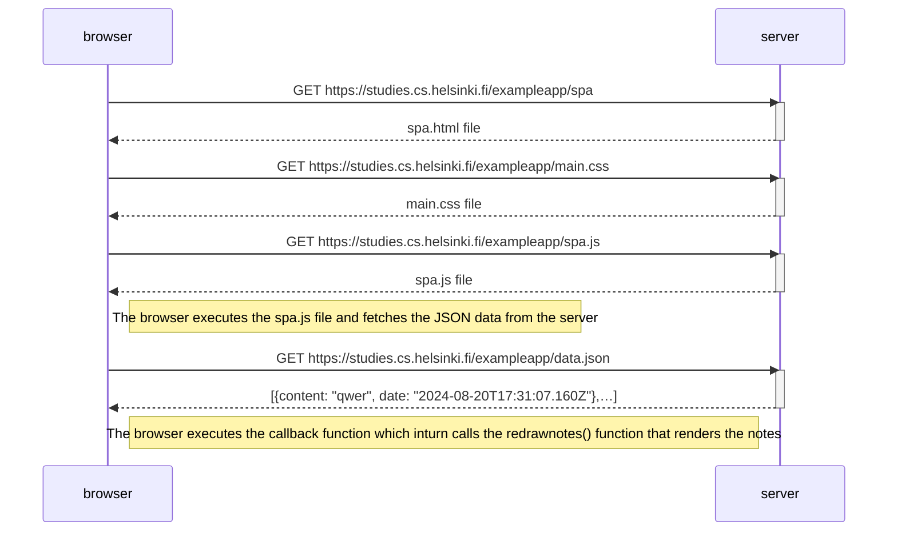

```mermaid
  sequenceDiagram
      participant browser
      participant server

      browser->>server: GET https://studies.cs.helsinki.fi/exampleapp/spa
      activate server
      server-->>browser: spa.html file
      deactivate server
  
      browser->>server: GET https://studies.cs.helsinki.fi/exampleapp/main.css
      activate server
      server-->>browser: main.css file
      deactivate server
  
      browser->>server: GET https://studies.cs.helsinki.fi/exampleapp/spa.js
      activate server
      server-->>browser: spa.js file
      deactivate server
  
      Note right of browser: The browser executes the spa.js file and fetches the JSON data from the server
  
      browser->>server: GET https://studies.cs.helsinki.fi/exampleapp/data.json
      activate server
      server-->>browser: [{content: "qwer", date: "2024-08-20T17:31:07.160Z"},…]
      deactivate server
  
      Note right of browser: The browser executes the callback function which inturn calls the redrawnotes() function that renders the notes
```
