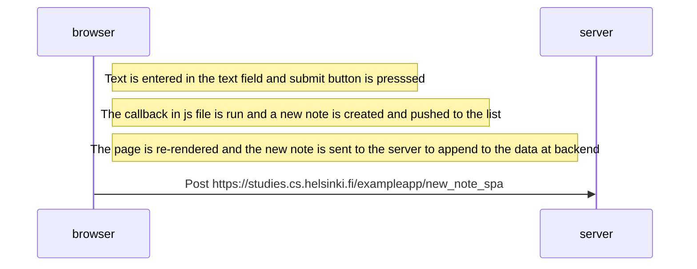

```mermaid
  sequenceDiagram
      participant browser
      participant server

      Note right of browser: Text is entered in the text field and submit button is presssed
      Note right of browser: The callback in js file is run and a new note is created and pushed to the list
      Note right of browser: The page is re-rendered and the new note is sent to the server to append to the data at backend
      browser->>server: Post https://studies.cs.helsinki.fi/exampleapp/new_note_spa
```
